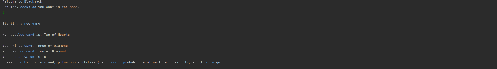

# Blackjack-Game

Basic implementation of blackjack game in console using principles of object-oriented programming. Also has the capability to print out probabilities of different cards and "card count" of the current deck to show when the deck has an increased chance in the player's odds.

Thw basics on card counting can be found [here](https://en.wikipedia.org/wiki/Card_counting)

instructions are printed out on the console upon start of the program

